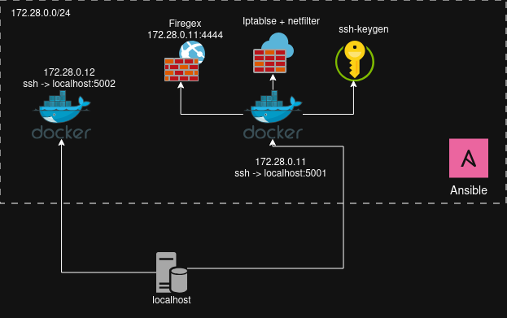

A/D CTF automatization pipelines
---


Данный репозиторий представляет собой тестовую сеть из демо хостов в которой, с помощью Ansible Role, разворачивается связка (IPtablse + Firegex + SSH-keygen) для мониторинга и управления сетевыми подключениями.

- `docker-compose.yml`: два Kali‑контейнера с SSH (ctf1, ctf2), проброшены 5001/5002.
- `start_ctf_network.sh`: сборка/подъём сетки, вывод SSH‑подсказок.
- `roles/AD_install`: ставит базовые утилиты (docker, git, expect и др.), Python, опционально iptables‑правила и Firegex в standalone.
- `inventory.yaml`: инвентарь Ansible

Поднять контейнеры
```
./start_ctf_network.sh

ansible-playbook -i inventory.yaml AD_role.yaml
ansible-playbook -i inventory.yaml ssh-key-deploy.yaml   # развернуть SSH-ключи без пароля
```

- `install_firegex`: true|false - ставить ли Firegex (standalone).
- `firegex_password`: пароль для firegex
- `iptables_apply`: true|false - применять ли встроенные iptables‑правила.
- `iptables_ruleset`: поставить шаблон правил


